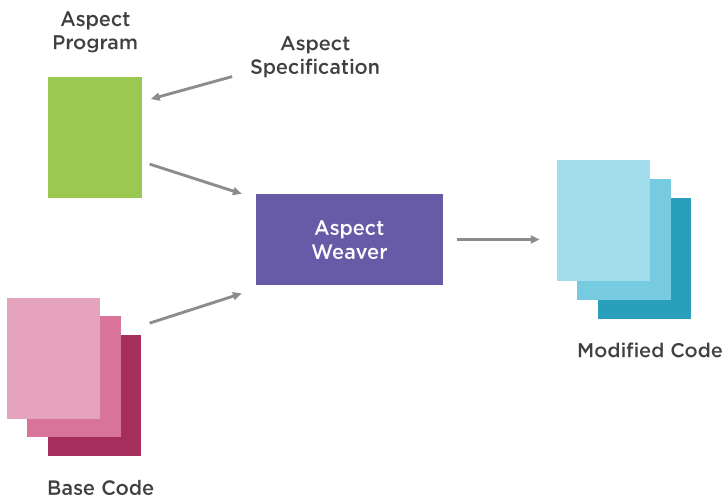

# Spring AOP
In this project I will put my notes about Spring AOP. It will include notes from the following courses:
- <span style="color:aquamarine">Spring Framework: Aspect Oriented Programming with Spring AOP</span>, by Catalin Tudose. **pluralsight**

The course will cover:
- What is Aspect Oriented Programming, AOP
- Introducing Spring AOP
- Implementing cross-cutting concerns for normal execution using Spring AOP
- Implementing crosscutting concerns for cashing and exceptions using Spring AOP
- Using Spring AOP introductions

Spring AOP complements the Spring IoC container, and is all about separating the real business problem from the cross-cutting functionalities. Cross-cutting functionalities are functionalities commonly needed in our code, regardless of the specific business logic being performed. They "cut across" multiple types and objects. Example of cross-cutting concerns are:
1. logging: always present in our methods body
2. exceptions handling: business methods will throw exceptions because of the operations they need to do. Eg. sql exceptions if they work with a db
3. user rights check: some users of our app may not be authorized to call some methods
4. caching: we don't want to call again the db for data that has been retrieved recently
5. transactions
6. tweaking legacy applications

For example:
```java
publica static Passenger getPassenger (int id){
    if (!SecurityContext.hasRight("getPassenger")){
        throw new RuntimeException("Permission denied!");
    }
    log.debug("Call method getPassenger with id " + id);
    Passenger passenger;
    try {
        if (cache.contains(id)){
            passenger = cache.get(id);
        } else {
            passenger = Database.getPassenger(id);
            cache.put(id,passenger);
        }
    } catch (SQLException e) {
        throw new RuntimeException(e);
    }
    log.debug("Passenger info: " + passenger.toString());
    return passenger;
}    
```
With AOP we take all these cross-cutting logic (or _concerns_) and move it separate classes called **aspects**, encapsulating them. The aspect will be the unit of modularity in AOP. In general, an aspect does something before (eg. a log message) a method, the runs the method, then does something after the method (eg. another log). Logging is a classical example of an aspect, it is "logging aspect". It is an example of orthogonal or cross-cutting concern in Java applications.

Spring implements AOP in two ways:
1. Schema based approach, which uses regular classes
2. `AspectJ` annotation style, which uses regular classes annotated with the aspect annotations

Spring AOP is implemented by using runtime proxies.


## Key AOP terms

The central AOP concepts and terminology not Spring-specific. They are:
- **Aspect**: A modularization of a concern that cuts across multiple classes. Transaction management and logging are examples. In Spring AOP, aspects are implemented by using regular classes (the schema-based approach) or regular classes annotated with the `@Aspect` annotation (the `@AspectJ` style).
- **Join point**: A point during the execution of a program, such as the execution of a method or the handling of an exception. In Spring AOP, a join point always represents a <u>method execution</u>.
- **Advice**: Action taken by an aspect at a particular join point. Different types of advice include "around", "before" and "after" advice. Many AOP frameworks, including Spring, model an advice as an <u>interceptor</u> and maintain a chain of interceptors around the join point.

  It seems that when we apply an advice to a method execution of a class (join point), that class, or type, is called an "advised object". 

- **Pointcut**: A predicate that matches join points. A _join point matcher_, I like to call it. Advice is associated with a pointcut expression and runs at any <u>join point matched by the pointcut</u> (for example, the execution of a method with a certain name).

 The concept of join points as matched by pointcut expressions is central to AOP. Spring uses the `AspectJ` <u>pointcut expression language by default</u>. We'll see examples later. Pointcuts enable advices to be applied independently of the object-oriented hierarchy. For example, you can apply an around advice providing declarative transaction management to a set of methods that span multiple objects (such as all business operations in the service layer).

- **Introduction**: Declaring additional methods or fields on behalf of a type. Spring AOP lets you introduce new interfaces (and a corresponding implementation) to any advised object. For example, you could use an introduction to make a bean implement an IsModified interface, to simplify caching. (An introduction is known as an inter-type declaration in the AspectJ community.)

- **Target object**: An object being advised by one or more aspects. Also referred to as the "advised object". Since Spring AOP is implemented by using runtime proxies, this object is always a proxied object.

- **AOP proxy**: An object created by the AOP framework in order to implement the aspect contracts (advise method executions and so on) so that it can add the aspects in the execution. Spring AOP provides two ways to create the AOP proxy:
  1. JDK dynamic proxy, which is the standard mechanism of proxy creation.
  2. Code Generation Library (CGLIB) proxy.
- **Weaving**: linking aspects with other application types or objects, to _create_ an advised object. This can be done at compile time (using the AspectJ compiler, for example), load time, or at runtime. Spring AOP, like other pure Java AOP frameworks, performs <u>weaving at runtime</u>.



Spring AOP includes the following types of advice:
- **Before**: Advice that runs before a join point but that does not have the ability to prevent execution flow proceeding to the join point (unless it throws an exception).
- **After returning**: Advice to be run after a join point completes normally (for example, if a method returns without throwing an exception).
- **After throwing**: Advice to be run if a method exits by throwing an exception.
- **After** (finally): Advice to be run _regardless_ of the means by which a join point exits (normal or exceptional return).

- **Around**: Advice that surrounds a join point such as a method invocation. This is the most powerful kind of advice. Around advice can perform custom behavior before and after the method invocation. It is also responsible for choosing whether to proceed to the join point or to shortcut the advised method execution by returning its own return value or throwing an exception.

Around advice is the most general kind of advice. Since Spring AOP, like AspectJ, provides a full range of advice types, it is recommended to use the least powerful advice type that can implement the required behavior. For example, if you need only to update a cache with the return value of a method, you are better off implementing an after returning advice than an around advice, although an around advice can accomplish the same thing. Using the most specific advice type provides a simpler programming model with less potential for errors. For example, you do not need to invoke the proceed() method on the JoinPoint used for around advice, and, hence, you cannot fail to invoke it.

All advice parameters are statically typed so that you work with advice parameters of the appropriate type (e.g. the type of the return value from a method execution) rather than Object arrays. ?

What we do before the main function is called a `@Before` advice, and that made after, an `@After` advice.
```java
public static Passenger getPassenger(int id) {
        log.debug("Call method getPassenger with id " + id);  // @Before advice
        Passenger passenger = Database.getPassenger(id);
        log.debug("Passenger info: " + passenger.toString()); // @After advice
        return passenger;
        }
```

## XML based Spring AOP

We need two maven dependencies for Spring AOP:
```xml
        <dependency>
            <groupId>org.springframework</groupId>
            <artifactId>spring-aop</artifactId>
        </dependency>

        <dependency>
            <groupId>org.springframework</groupId>
            <artifactId>spring-aspects</artifactId>
        </dependency>
```
However, dependency `spring-aop` is already included as a transitive dependency of `spring-context`:
```text
com.example:SpringAOP:jar:0.0.1-SNAPSHOT
+- org.springframework:spring-context:jar:5.2.19.RELEASE:compile
|  +- org.springframework:spring-aop:jar:5.2.19.RELEASE:compile
|  +- org.springframework:spring-beans:jar:5.2.19.RELEASE:compile
|  +- org.springframework:spring-core:jar:5.2.19.RELEASE:compile
|  |  \- org.springframework:spring-jcl:jar:5.2.19.RELEASE:compile
|  \- org.springframework:spring-expression:jar:5.2.19.RELEASE:compile
\- org.springframework:spring-aspects:jar:5.2.19.RELEASE:compile
   \- org.aspectj:aspectjweaver:jar:1.9.7:compile
```

If we use xml configuration we'll need to include the AOP namespace and xml schema definition (xsd), where we can find the definition of the aop namespace ?

With xml configuration we need to define the class that will be an aspect as a bean. In the example below it is `Bluesky`.
Notice that Spring AOP will be able to add aspects only into Spring managed beans. The `sleep()` statements below are only needed to see things printed in order in the console. Also, I will use stupid names just to illustrate that the aspect class and advice methods can have any name, still notice how the reference names in the schema definition, file `aop.xml`, must match. For the same purpose, I will print simple messages in the advice methods, instead of logging something.
```xml
<?xml version="1.0" encoding="UTF-8"?>
<beans xmlns="http://www.springframework.org/schema/beans"
       xmlns:xsi="http://www.w3.org/2001/XMLSchema-instance"
       xmlns:aop="http://www.springframework.org/schema/aop"
       xsi:schemaLocation="http://www.springframework.org/schema/beans http://www.springframework.org/schema/beans/spring-beans-3.0.xsd
            http://www.springframework.org/schema/aop http://www.springframework.org/schema/aop/spring-aop-3.0.xsd">

  <bean id="passengerDao" class="com.example.aop.example1.PassengerDaoImpl"/>
  <bean id="classA" class="com.example.aop.example1.ClassA"/>

  <bean id="bluesky" class="com.example.aop.example1.Bluesky"/>

  <aop:config>
    <aop:aspect id="bluesky" ref="bluesky"> <!--the aspect class-->
      <!--The point cut (join point matcher) with the AspectJ expression language to match a method name-->      
      <aop:pointcut id="terra" expression="execution(* com.example.aop.example1.*.*(..))"/> 
      
      <!--the advice methods of the aspect class, and to be applied in
      the point cut above-->
      <aop:before pointcut-ref="terra" method="pipi"/> 
      <aop:after pointcut-ref="terra" method="popo"/>
    </aop:aspect>
  </aop:config>

</beans>
```
```java
// This is the aspect class
//public class LoggingAspect {
public class Bluesky {

  private Logger logger = Logger.getLogger(Bluesky.class.getName());

  //public void before() {
  public void pipi() {
    System.out.println("---- Entering method");
    //logger.info("Entering method");
  }

  //public void after() {
  public void popo(){
    System.out.println("---- Exiting method");
    //logger.info("Exiting method");
  }

}
```
```java
public interface PassengerDao {    Passenger getPassenger(int id);    }
```
```java

public class PassengerDaoImpl implements PassengerDao {

    private static Map<Integer, Passenger> passengersMap = new HashMap<>();
    public Passenger getPassenger(int id) {

        try {  Thread.sleep(100);  } catch (InterruptedException e) {  e.printStackTrace();  }

        System.out.println("inside PassengerDaoImp.getPassenger()");
        if (null != passengersMap.get(id)) {
            return passengersMap.get(id);
        }

        Passenger passenger = new Passenger(id);
        passengersMap.put(id, passenger);

        System.out.println("quiting PassengerDapImpl.getPassenger()");

        try {  Thread.sleep(100);  } catch (InterruptedException e) {  e.printStackTrace();  }
        return passenger;
    }
}
```
```java
public class ClassA {
    public void printHello(){
        try {  Thread.sleep(1000); }
        catch (InterruptedException e) {  e.printStackTrace();  }
        System.out.println("Hello !");
    }
}
```
```java
public class PassengersManager {

  public static void main(String[] args) {

    ApplicationContext context = new ClassPathXmlApplicationContext("example1/aop.xml");

    PassengerDao passengerDao = (PassengerDao) context.getBean("passengerDao");

    System.out.println(passengerDao.getPassenger(1));

    ClassA classA = (ClassA) context.getBean("classA");
    classA.printHello();
  }
}
```
This prints
```text
---- Entering method
inside PassengerDaoImp.getPassenger()
quiting PassengerDapImpl.getPassenger()
---- Exiting method
Passenger: 1
---- Entering method
Hello !
---- Exiting method
```

## AspectJ based SpringAOP
The aspect configuration in the schema definition above, file `aop.xml`, can be done directly in the aspect class, with the help of `AspectJ` annotations. We would only need to define the aspect bean and enable AspectJ with `<aop:aspectj-autoproxy/>`, in the schema definition:
```xml
<?xml version="1.0" encoding="UTF-8"?>
<beans xmlns="http://www.springframework.org/schema/beans"
       xmlns:xsi="http://www.w3.org/2001/XMLSchema-instance"
       xmlns:aop="http://www.springframework.org/schema/aop"
       xsi:schemaLocation="http://www.springframework.org/schema/beans http://www.springframework.org/schema/beans/spring-beans-3.0.xsd
            http://www.springframework.org/schema/aop http://www.springframework.org/schema/aop/spring-aop-3.0.xsd">

<!--    to enable AspectJ support-->
    <aop:aspectj-autoproxy/>

    <bean id="passengerDao" class="com.example.aop.example2.PassengerDaoImpl"/>
    <bean id="loggingAspect" class="com.example.aop.example2.LoggingAspect"/>

</beans>
```
```java
import org.aspectj.lang.annotation.After;
import org.aspectj.lang.annotation.Aspect;
import org.aspectj.lang.annotation.Before;

import java.util.logging.Logger;

@Aspect
public class LoggingAspect {

    private Logger logger = Logger.getLogger(LoggingAspect.class.getName());

    @Before("execution(* *.*Passenger(..))")
    public void before(){
        logger.info("Entering method");
    }

    @After("execution(* *.*Passenger(..))")
    public void after(){
        logger.info("Exiting method");
    }
}
```
In this case we pass to the AspectJ annotation AspectJ expression language strings, specifying the point cut where the advice method will be applied.

## The `@Around` annotation
The `@Around` annotation of AspectJ can wrap a join point completely, allowing to execute any actions before and after the advised method. It will get a reference to the beginning of the method block, `ProceedingJoinPoint`, with which we can decide whether to execute it or not. In the example below we print log messages before and after executing the method body with `Object result = thisJoinPoint.proceed();`.
```java
@Aspect
public class LoggingAspect {

    private Logger logger = Logger.getLogger(LoggingAspect.class.getName());

    @Around("execution(* *.*Passenger(..))")
    public Object log (ProceedingJoinPoint thisJoinPoint) throws Throwable {
        String methodName = thisJoinPoint.getSignature().getName();
        Object[] methodArgs = thisJoinPoint.getArgs();
        logger.info("Call method " + methodName + "with args " + methodArgs[0]);
        Object result = thisJoinPoint.proceed();
        logger.info("Method " + methodName+" returns " + result);
        return result;
    }
}
```
I think `@Around` uses the After returning advice, ie. even if method throws an exception, what fallows after the call to `proceed()` will not be executed.

## AOP mechanism
How AOP works ? When we create an advice for a method of a class, say "ClassA", that implements an interface, Spring will implement AOP by means of a proxy class of ClassA implementing the same interface. Then, at runtime, when we call the adviced method of the proxied class, Spring will actually run the implementation in the new proxy class. This implementation will run the aspect class having all the advices we created and a call to the original method body as well. For the proxy class, Spring will use JDK dynamic proxies. 

For example, in the example above the proxied class will be `PassengerDaoImpl`. The new proxy class will be something like the following, and this is what the Spring IoC container will give back, when we ask him for a `PassengerDao` bean.

```java
import com.example.aop.example2.LoggingAspect;
import com.example.aop.example3.PassengerDao;
import org.aspectj.lang.ProceedingJoinPoint;
import org.aspectj.lang.Signature;
import org.aspectj.lang.reflect.SourceLocation;
import org.aspectj.runtime.internal.AroundClosure;

class PassengerDaoProxy implements PassengerDao {

  //the original object will be wired here, the delegate, I think
  PassengerDao passengerDao;

  public Passenger getPassenger(int id) {

    // this is the logging aspect class WE defined above
    Aspect logger = new LoggingAspect();

    ProceedingJoinPoint joinPoint = new ProceedingJoinPoint() {
                                            @Override
                                            public Object proceed() throws Throwable {
                                              return passengerDao.getPassenger(id);
                                            }
                                            @Override
                                            public Signature getSignature() {
                                              // something that returns the signature of the method;
                                            }
                                    };
    return logger.log(joinPoint);
  }
}
```
Yet, I don't understand how the `ProceedingJoinPoint joinPoint` will carry information of the original class being proxied, such as the method being invoked and its arguments. This is retrieved in `LoggingAspect.log()` !!??

