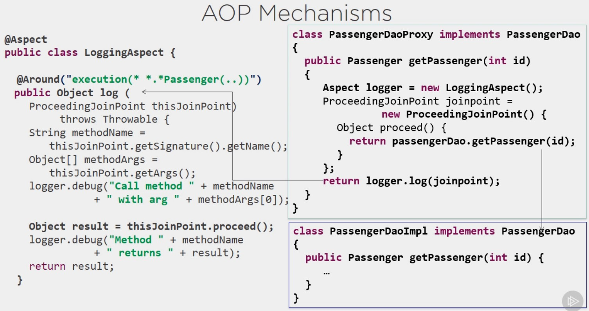
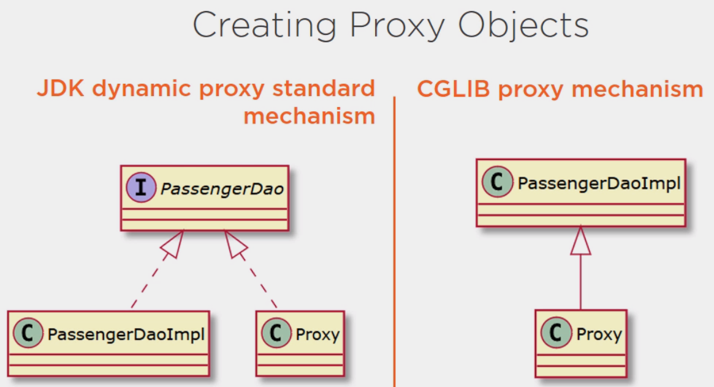
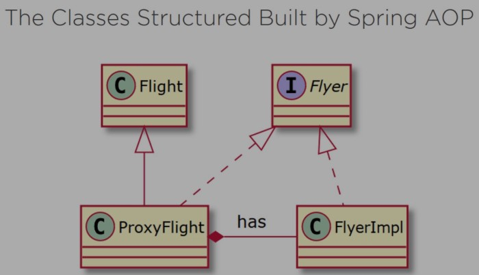

# Spring AOP

In this project I will put my notes about Spring AOP. It will include notes from the following courses:

- <span style="color:aquamarine">Spring Framework: Aspect Oriented Programming with Spring AOP</span>, by Catalin
  Tudose. **pluralsight**
- <span style="color:aquamarine">Mastering Spring Framework Fundamentals</span>, by Matthew Speak. O'Reilly. **pluralsight**


The course will cover:

- What is Aspect Oriented Programming, AOP
- Introducing Spring AOP
- Implementing cross-cutting concerns for normal execution using Spring AOP
- Implementing crosscutting concerns for cashing and exceptions using Spring AOP
- Using Spring AOP introductions

Spring AOP complements the Spring IoC container, and is all about separating the real business problem from the
cross-cutting functionalities. Cross-cutting functionalities are functionalities commonly needed in our code, regardless
of the specific business logic being performed. They "cut across" multiple types and objects. Example of cross-cutting
concerns are:

1. logging: always present in our methods body. Eg. in/out logging, method execution time logging
2. exceptions handling: business methods will throw exceptions because of the operations they need to do. Eg. sql
   exceptions if they work with a db
3. security: user with right credentials, some users of our app may not be authorized to call some methods
4. caching: we don't want to call again the db for data that has been retrieved recently
5. transactions: begin a transaction before a method starts and end it after.
6. tweaking legacy applications

For example:

```java
publica static Passenger getPassenger(int id){
        if(!SecurityContext.hasRight("getPassenger")){
        throw new RuntimeException("Permission denied!");
        }
        log.debug("Call method getPassenger with id "+id);
        Passenger passenger;
        try{
        if(cache.contains(id)){
        passenger=cache.get(id);
        }else{
        passenger=Database.getPassenger(id);
        cache.put(id,passenger);
        }
        }catch(SQLException e){
        throw new RuntimeException(e);
        }
        log.debug("Passenger info: "+passenger.toString());
        return passenger;
        }    
```

With AOP we take all these cross-cutting logic (or _concerns_) and move it separate classes called **aspects**,
encapsulating them. The aspect will be the unit of modularity in AOP. In general, an aspect does something before (eg. a
log message) a method, the runs the method, then does something after the method (eg. another log). Logging is a
classical example of an aspect, it is "logging aspect". It is an example of orthogonal or cross-cutting concern in Java
applications.

Spring allows using AOP in two ways:
1. Using Spring AOP, which is Spring's dynamic proxies and CGLIB classes. `ProxyFactory`, `ProxyFactoryBean`. Works at run time 
2. Using the `AspectJ` annotation, which uses regular classes annotated with the aspect annotations. Weave or merge with our byte code, additional aspect byte code generated by AspectJ at build time. Gives faster execution time.

That's why in the pom we import both `spring-aspects` and `spring-aop`.

Spring AOP is implemented by using runtime proxies.

## Key AOP terms

The central AOP concepts and terminology not Spring-specific. They are:

- **Aspect**: A modularization of a concern that cuts across multiple classes. Transaction management and logging are
  examples. In Spring AOP, aspects are implemented by using regular classes (the schema-based approach) or regular
  classes annotated with the `@Aspect` annotation (the `@AspectJ` style).

- **Join point**: A point during the execution of a program, or in our code, such as the call of a method, or the handling of an
  exception. In Spring AOP, a join point always represents a <u>method execution</u>. Joint point will match certain
  patterns. These patters are called "pointcuts".

- **Advice**: Action taken by an aspect at a particular join point. Different types of advice include "around", "before"
  and "after" advice. Many AOP frameworks, including Spring, model advices as an <u>interceptor</u>, and maintain a
  chain of interceptors around the join point.

  It seems that when we apply an advice to a method execution of a class (join point), that class, or type, is called
  an "advised object".

- **Pointcut**: A predicate that matches join points. A _join point matcher_, as I prefer to call it. Every advice will be 
  associated with a pointcut expression and will run at any <u>join point matched by that pointcut</u> (for example, the
  execution of a method with a certain name).

The concept of join points as matched by pointcut expressions is central to AOP. Spring uses the `AspectJ` <u>pointcut
expression language by default</u>. We'll see examples later. Pointcuts enable advices to be applied independently of
the object-oriented hierarchy. For example, you can apply an around advice providing declarative transaction management
to a set of methods that span multiple objects (such as all business operations in the service layer).

- **Introduction**: Declaring additional methods or fields on behalf of a type. Spring AOP lets you introduce new
  interfaces (and a corresponding implementation) to any advised object. For example, you could use an introduction to
  make a bean implement an IsModified interface, to simplify caching. (An introduction is known as an inter-type
  declaration in the AspectJ community.)

- **Target object**: An object being advised by one or more aspects. Also referred to as the "advised object". Since
  Spring AOP is implemented by using runtime proxies, this object is always a proxied object.

- **AOP proxy**: An object created by the AOP framework in order to implement the aspect contracts (advise method
  executions and so on) so that it can add the aspects in the execution. Spring AOP provides two ways to create the AOP
  proxy:
    1. JDK dynamic proxy, which is the standard mechanism of proxy creation.
    2. Code Generation Library (CGLIB) proxy.
- **Weaving**: linking aspects with other application types or objects, to _create_ an advised object. This can be done
  at compile time (using the AspectJ compiler, for example), load time, or at runtime. Spring AOP, like other pure Java
  AOP frameworks, performs <u>weaving at runtime</u>.


Spring AOP includes the following types of advice:

- **Before**: Advice that runs before a join point but that does not have the ability to prevent execution flow
  proceeding to the join point (unless it throws an exception).
- **After returning**: Advice to be run after a join point completes _normally_ (for example, if a method returns
  without throwing an exception).
- **After throwing**: Advice to be run if a method exits by throwing an exception.
- **After** (finally): _After whatever_. Advice to be run _regardless_ of the means by which a join point exits (normal or exceptional
  return).

- **Around**: Advice that surrounds a join point such as a method invocation. This is the most powerful kind of advice.
  Around advice can perform custom behavior before and after the method invocation. It is also responsible for choosing
  whether to proceed to the join point or to shortcut the advised method execution by returning its own return value or
  throwing an exception.

  If inside an Around annotated method we throw an exception, and we don't handle it, the programs interrupts there.

Around advice is the most general kind of advice. Since Spring AOP, like AspectJ, provides a full range of advice types,
it is recommended to use the least powerful advice type that can implement the required behavior. For example, if you
need only to update a cache with the return value of a method, you are better off implementing an after returning advice
than an around advice, although an around advice can accomplish the same thing. Using the most specific advice type
provides a simpler programming model with less potential for errors. For example, you do not need to invoke the
proceed() method on the JoinPoint used for around advice, and, hence, you cannot fail to invoke it.

All advice parameters are statically typed so that you work with advice parameters of the appropriate type (e.g. the
type of the return value from a method execution) rather than Object arrays. ?

What we do before the main function is called a `@Before` advice, and that made after, an `@After` advice.

```java
public static Passenger getPassenger(int id){
        log.debug("Call method getPassenger with id "+id);  // @Before advice
        Passenger passenger=Database.getPassenger(id);
        log.debug("Passenger info: "+passenger.toString()); // @After advice
        return passenger;
        }
```

With AspectJ it is also possible to intercept the writing of particular fields of an object. 

## Java based Spring AOP. (Matthew course)
We'll start by giving some examples of Spring AOP with using Java configuration. The next paragraph though will give many others, but using xml configuration.

Advice methods will be called and run when their pointcut matches a given join point. At run time, in fact, when a pointcut matches a join point, an object of type `JoinPoint` is created and loaded with all the information of the invocation. The advice method may receive in its arguments the `JoinPoint` object and use its content for any logic. For example, we can use the arguments and the method signature of the intercepted method programmatically in the advice method. This is illustrated in the example below, in the advice method `intercept3()`.

`JoinPoint` and `ProceedingJoinPoint` are interfaces actually, both from `org.aspectj.lang`. They are implemented by `MethodInvocationProceedingJoinPoint` from `org.springframework.aop.aspectj`, but also by `JoinPointImpl` from `org.aspectj.runtime.reflect`:
```text
(I) JoinPoint (org.aspectj.lang)
  (I) ProceedingJoinPoint (org.aspectj.lang)
    (C) JoinPointImpl (org.aspectj.runtime.reflect)
    (C) MethodInvocationProceedingJoinPoint (org.springframework.aop.aspectj)
```

Aspect classes need to be also Spring managed beans. Therefore, we must annotate them with `@Component`, besides `@Aspect`
```java
import org.aspectj.lang.JoinPoint;
import org.aspectj.lang.annotation.After;
import org.aspectj.lang.annotation.Aspect;
import org.aspectj.lang.annotation.Before;
import org.springframework.stereotype.Component;

import java.util.Arrays;

@Aspect
@Component // aspects need to be Spring managed beans as well!
public class MyAspect {

    // the class MyService will be looked for in this package
    @Before("execution(void MyService.doSomething(..))")
    public void intercept(){
        System.out.println("Intercepted!");
    }

    // intercept all methods
    @Before("execution(void MyService.*(..))")
    public void intercept2(){
        System.out.println("Intercepted all!");
    }

    // using the JoinPoint
    @After("execution(void MyService.*(int))")
    public void intercept3(JoinPoint joinPoint){
        System.out.println("Using Join Point "+ Arrays.toString(joinPoint.getArgs()));
    }
}
```
```java
@Service
public class MyService {

    public void doSomething(){
        System.out.println("doing business method");
    }

    public void doSomeOtherThing(int number){
        System.out.println("doing a different business method. Number: "+number);
    }
}
```
Here is the configuration class to discover the beans. The annotation `@EnableAspectJAutoProxy` takes `@Aspect` annotated Spring beans in the context and use them to create proxies as defined in the aspect class by the different used advice annotations. It is the equivalent of `<aop:aspectj-autoproxy/>` in xml configuration.
```java
@Configuration
@ComponentScan("com.example.aop.matthew")
@EnableAspectJAutoProxy
public class AppConfig {
}
```
In the main():
```java
public class DemoApplication {
    public static void main(String[] args) {
        ApplicationContext context = new AnnotationConfigApplicationContext(AppConfig.class);
        MyService service = context.getBean(MyService.class);
        service.doSomething();
        System.out.println();
        service.doSomeOtherThing(3);
    }
}
```
This will print 
```text
Intercepted!
Intercepted all!
doing business method

Intercepted all!
doing a different business method. Number: 3
Using Join Point [3]
```

The `@Around` annotation wraps the whole execution of an adviced method. An `@Around` annotated method commonly receives as argument a `ProceedingJoinPoint`, which give the additional method `proceed()` to let the method proceed, only if we wish so according to some logic. For example, consider the advice method `interceptor4()` below:
```java
@Service
public class MyService {
    public void sayWord(String word){
        System.out.println("I'm telling: " + word);
    }
}
```
```java
@Aspect
@Component // aspects need to be Spring managed beans as well!
public class MyAspect {
    @Around("execution(void MyService.sayWord(String))")
    public void interceptor4(ProceedingJoinPoint proceedingJoinPoint) throws Throwable {

        System.out.println("sayWord() called ! ");
        Object[] args = proceedingJoinPoint.getArgs();
        String word = args[0].toString();

        if ( word.length() > 8)
            System.out.println("Ignoring. Word is too long");
        else
            proceedingJoinPoint.proceed();

        System.out.println("Args are: "+ Arrays.toString(proceedingJoinPoint.getArgs()));
    }
}
```
```java
public class DemoApplication {
    public static void main(String[] args) {
        ApplicationContext context = new AnnotationConfigApplicationContext(AppConfig.class);
        MyService service = context.getBean(MyService.class);
        service.sayWord("Hello, my name is Camilo");
    }
}
```
This would print
```text
sayWord() called ! 
Ignoring. Word is too long  // instead of "I'm telling: Hello, my name is John"
Args are: [Hello, my name is John]
```

## XML based Spring AOP

We need two maven dependencies for Spring AOP:

```xml
        <!--already included as transitive dependency of spring-context-->
<dependency>
    <groupId>org.springframework</groupId>
    <artifactId>spring-aop</artifactId>
</dependency>

<dependency>
<groupId>org.springframework</groupId>
<artifactId>spring-aspects</artifactId>
</dependency>
```

However, dependency `spring-aop` is already included as a transitive dependency of `spring-context`, so we'll only need
to add `spring-aspect` if we already have a Spring application set up:

```text
com.example:SpringAOP:jar:0.0.1-SNAPSHOT
+- org.springframework:spring-context:jar:5.2.19.RELEASE:compile
|  +- org.springframework:spring-aop:jar:5.2.19.RELEASE:compile
|  +- org.springframework:spring-beans:jar:5.2.19.RELEASE:compile
|  +- org.springframework:spring-core:jar:5.2.19.RELEASE:compile
|  |  \- org.springframework:spring-jcl:jar:5.2.19.RELEASE:compile
|  \- org.springframework:spring-expression:jar:5.2.19.RELEASE:compile
\- org.springframework:spring-aspects:jar:5.2.19.RELEASE:compile
   \- org.aspectj:aspectjweaver:jar:1.9.7:compile
```

Notice how `spring-aspects` pulls as transitive dependency `aspectjweaver`.

If we use xml configuration we'll need to include the AOP namespace and xml schema definition (xsd), where we can find
the definition of the aop namespace ?

With xml configuration we need to define the class that will be an aspect as a bean. In the example below it
is `Bluesky`. Notice that Spring AOP will be able to add aspects only into Spring managed beans. The `sleep()`
statements below are only needed to see things printed in order in the console. Also, I will use stupid names just to
illustrate that the aspect class and advice methods can have any name, still notice how the reference names in the
schema definition, file `aop.xml`, must match. For the same purpose, I will print simple messages in the advice methods,
instead of logging something.

```xml
<?xml version="1.0" encoding="UTF-8"?>
<beans xmlns="http://www.springframework.org/schema/beans"
       xmlns:xsi="http://www.w3.org/2001/XMLSchema-instance"
       xmlns:aop="http://www.springframework.org/schema/aop"
       xsi:schemaLocation="http://www.springframework.org/schema/beans http://www.springframework.org/schema/beans/spring-beans-3.0.xsd
            http://www.springframework.org/schema/aop http://www.springframework.org/schema/aop/spring-aop-3.0.xsd">

    <bean id="passengerDao" class="com.example.aop.example1.PassengerDaoImpl"/>
    <bean id="classA" class="com.example.aop.example1.ClassA"/>

    <bean id="bluesky" class="com.example.aop.example1.Bluesky"/>

    <aop:config>
        <aop:aspect id="bluesky" ref="bluesky"> <!--the aspect class-->
            <!--The point cut (join point matcher) with the AspectJ expression language to match a method name-->
            <aop:pointcut id="terra" expression="execution(* com.example.aop.example1.*.*(..))"/>

            <!--the advice methods of the aspect class, and to be applied in
            the point cut above-->
            <aop:before pointcut-ref="terra" method="pipi"/>
            <aop:after pointcut-ref="terra" method="popo"/>
        </aop:aspect>
    </aop:config>

</beans>
```

```java
// This is the aspect class
//public class LoggingAspect {
public class Bluesky {

    private Logger logger = Logger.getLogger(Bluesky.class.getName());

    //public void before() {
    public void pipi() {
        System.out.println("---- Entering method");
        //logger.info("Entering method");
    }

    //public void after() {
    public void popo() {
        System.out.println("---- Exiting method");
        //logger.info("Exiting method");
    }

}
```

```java
public interface PassengerDao {
    Passenger getPassenger(int id);
}
```

```java

public class PassengerDaoImpl implements PassengerDao {

    private static Map<Integer, Passenger> passengersMap = new HashMap<>();

    public Passenger getPassenger(int id) {

        try {
            Thread.sleep(100);
        } catch (InterruptedException e) {
            e.printStackTrace();
        }

        System.out.println("inside PassengerDaoImp.getPassenger()");
        if (null != passengersMap.get(id)) {
            return passengersMap.get(id);
        }

        Passenger passenger = new Passenger(id);
        passengersMap.put(id, passenger);

        System.out.println("quiting PassengerDapImpl.getPassenger()");

        try {
            Thread.sleep(100);
        } catch (InterruptedException e) {
            e.printStackTrace();
        }
        return passenger;
    }
}
```

```java
public class ClassA {
    public void printHello() {
        try {
            Thread.sleep(1000);
        } catch (InterruptedException e) {
            e.printStackTrace();
        }
        System.out.println("Hello !");
    }
}
```

```java
public class PassengersManager {

    public static void main(String[] args) {

        ApplicationContext context = new ClassPathXmlApplicationContext("example1/aop.xml");

        PassengerDao passengerDao = (PassengerDao) context.getBean("passengerDao");

        System.out.println(passengerDao.getPassenger(1));

        ClassA classA = (ClassA) context.getBean("classA");
        classA.printHello();
    }
}
```

This prints

```text
---- Entering method
inside PassengerDaoImp.getPassenger()
quiting PassengerDapImpl.getPassenger()
---- Exiting method
Passenger: 1
---- Entering method
Hello !
---- Exiting method
```

## AspectJ based SpringAOP

The aspect configuration in the schema definition above, file `aop.xml`, can be done directly in the aspect class, with
the help of `AspectJ` annotations. We would only need to define the aspect bean and enable AspectJ
with `<aop:aspectj-autoproxy/>`, in the schema definition:

```xml
<?xml version="1.0" encoding="UTF-8"?>
<beans xmlns="http://www.springframework.org/schema/beans"
       xmlns:xsi="http://www.w3.org/2001/XMLSchema-instance"
       xmlns:aop="http://www.springframework.org/schema/aop"
       xsi:schemaLocation="http://www.springframework.org/schema/beans http://www.springframework.org/schema/beans/spring-beans-3.0.xsd
            http://www.springframework.org/schema/aop http://www.springframework.org/schema/aop/spring-aop-3.0.xsd">

    <!--    to enable AspectJ support-->
    <aop:aspectj-autoproxy/>

    <bean id="passengerDao" class="com.example.aop.example2.PassengerDaoImpl"/>
    <bean id="loggingAspect" class="com.example.aop.example2.LoggingAspect"/>

</beans>
```

```java
import org.aspectj.lang.annotation.After;
import org.aspectj.lang.annotation.Aspect;
import org.aspectj.lang.annotation.Before;

import java.util.logging.Logger;

@Aspect
public class LoggingAspect {

    private Logger logger = Logger.getLogger(LoggingAspect.class.getName());

    @Before("execution(* *.*Passenger(..))")
    public void before() {
        logger.info("Entering method");
    }

    @After("execution(* *.*Passenger(..))")
    public void after() {
        logger.info("Exiting method");
    }
}
```

In this case we pass to the AspectJ annotation AspectJ expression language strings, specifying the point cut where the
advice method will be applied.

## The `@Around` annotation

The `@Around` annotation of AspectJ can wrap a join point completely, allowing to execute any actions before and after
the advised method. It will get a reference to the beginning of the method block, `ProceedingJoinPoint`, with which we
can decide whether to execute it or not. In the example below we print log messages before and after executing the
method body with `Object result = thisJoinPoint.proceed();`.

```java

@Aspect
public class LoggingAspect {

    private Logger logger = Logger.getLogger(LoggingAspect.class.getName());

    // this is AspectJ expression language for the point cut
    @Around("execution(* *.*Passenger(..))")
    public Object log(ProceedingJoinPoint thisJoinPoint) throws Throwable {
        String methodName = thisJoinPoint.getSignature().getName();
        Object[] methodArgs = thisJoinPoint.getArgs();
        logger.info("Call method " + methodName + "with args " + methodArgs[0]);
        Object result = thisJoinPoint.proceed();
        logger.info("Method " + methodName + " returns " + result);
        return result;
    }
}
```

I think `@Around` uses the After returning advice, ie. even if method throws an exception, what fallows after the call
to `proceed()` will not be executed.

## AOP mechanism

How AOP works ? When we create an advice for a method of a class, say "ClassA", that implements an interface, Spring
will implement AOP by means of a proxy class of ClassA implementing the same interface. Then, at runtime, when we call
the adviced method of the proxied class, Spring will actually run the implementation in the new proxy class. This
implementation will run the aspect class having all the advices we created and a call to the original method body as
well. For the proxy class, Spring will use JDK dynamic proxies if the target class implements an interface.

For example, in the example above the proxied class is `PassengerDaoImpl`. The new proxy class is something like the
following, and this is what the Spring IoC container will give back, when we ask him for a `PassengerDao` bean.

```java
import com.example.aop.example2.LoggingAspect;
import com.example.aop.example3.PassengerDao;
import org.aspectj.lang.ProceedingJoinPoint;
import org.aspectj.lang.Signature;
import org.aspectj.lang.reflect.SourceLocation;
import org.aspectj.runtime.internal.AroundClosure;

class PassengerDaoProxy implements PassengerDao {

    //the original object will be wired here, the delegate, I think
    PassengerDao passengerDao;

    public Passenger getPassenger(int id) {

        // this is the logging aspect class WE defined above
        Aspect logger = new LoggingAspect();

        ProceedingJoinPoint joinPoint = new ProceedingJoinPoint() {
            @Override
            public Object proceed() throws Throwable {
                return passengerDao.getPassenger(id);
            }

            @Override
            public Signature getSignature() {
                // something that returns the signature of the method;
            }
        };
        return logger.log(joinPoint);
    }
}
```

In the proxy class, there will be a field of interface typo pointing to an anonymous class,
the `ProceedingJoinPoint joinPoint`. This class will define the methods not only to proceed with the execution of the
method advised method in the target class, `proceed()`, but also to get the name and arguments of the
latter, `getSignature()` and `getArgs()`. This information is needed in the aspect class's advice method, annotated
with, `@Around`, as in this figure:



As mentioned, Spring uses two strategies to create the proxy objects

1. JDK dynamic proxy standard mechanism: used if the class that needs to be proxied implements an interface. The new
   proxy class will implement the same interface, and it will be returned when we ask the context for a bean of the
   proxied class. Notice that the new proxy class cannot be cast to the proxied class, as they are implementing the same
   interfaces but are two separate classes. The following would give an error:

```java
//the bean named 'passengerDao' is the proxied class, so we'll get the proxy class from the context instead        
PassengerDao passengerDao=(PassengerDaoImpl)context.getBean("passengerDao");
```

2. CGLIB proxy mechanisms: used when the target class does not implement any interface. In this case, the proxy class
   will extend the target class itself, being able to substitute it this way. Again we, will get this new subclass (
   proxy class) from the context when we ask for such bean:

```java
PassengerDaoImpl passengerDao=(PassengerDaoImpl)context.getBean("passengerDao");
```

If our class does not implement an interface and is final, there will be no way for Spring to build a proxy for it and
we'll not be able to use Spring AOP. Similarly, if our class is not final (and does not implement any interface either),
but the method that needs to be advised is final, it will not be overwritten by the proxy CGLIB sublclass Spring builds
in this case, making the proxy mechanisms, and thus AOP, not to work in this case either.



## Orthogonal behaviour for normal execution with custom annotation

The point cut definition we use in the around annotation can be a custom annotation as well, such that the matched join
points will be any method annotated with such annotation. This avoids sticking to some naming convention and signature
in the methods we want to advice, as we did in the example above. Now we only need to annotate them with our new maker
annotation. Only to methods such annotated will be applied the AOP mechanisms.

```java
public @interface Log {
}
```

```java

@Aspect
public class LoggingAspect {

    private Logger logger = Logger.getLogger(LoggingAspect.class.getName());

    @Around("@annotation(com.example.aop.example4.Log)")
    public Object log(ProceedingJoinPoint thisJoinPoint) throws Throwable {
        String methodName = thisJoinPoint.getSignature().getName();
        Object[] methodArgs = thisJoinPoint.getArgs();
        logger.info("Call method " + methodName + "with args " + methodArgs[0]);
        Object result = thisJoinPoint.proceed();
        logger.info("Method " + methodName + " returns " + result);
        return result;
    }
}
```

```java
public class PassengerDaoImpl implements PassengerDao {

    private static Map<Integer, Passenger> passengersMap = new HashMap<>();

    @Log
    public Passenger getPassenger(int id) {
        // ...
    }

}
```

## Orthogonal behaviour for exceptions

In the aspect class we can use another annotation with a point cut that will match the throwing of an exception by any
method, `@AfterThrowing()`. As before, both, the aspect class and the class from whom we went to intercept a potential
exception thrown, with the advice method, need to be Spring beans. In the example below, we'll simply annotate these
classes to make them beans, while leaving in the xml schema definition the component scan and the autoproxy definition
only:

```xml
<?xml version="1.0" encoding="utf-8" ?>
<beans xmlns="http://www.springframework.org/schema/beans"
       xmlns:xsi="http://www.w3.org/2001/XMLSchema-instance"
       xmlns:context="http://www.springframework.org/schema/context"
       xmlns:aop="http://www.springframework.org/schema/aop"
       xsi:schemaLocation="http://www.springframework.org/schema/beans http://www.springframework.org/schema/beans/spring-beans.xsd
                            http://www.springframework.org/schema/context http://www.springframework.org/schema/context/spring-context.xsd
                            http://www.springframework.org/schema/aop http://www.springframework.org/schema/aop/spring-aop-3.0.xsd">

    <!--    to enable AspectJ support-->
    <aop:aspectj-autoproxy/>

    <context:component-scan base-package="com.example.aop.example5"/>

</beans>
```

```java

@Service("passengerDao")
public class PassengerDaoImpl implements PassengerDao {

    private static Map<Integer, Passenger> passengersMap = new HashMap<>();

    public Passenger getPassenger(int id) {

        try {
            Thread.sleep(100);
        } catch (InterruptedException e) {
            e.printStackTrace();
        }

        System.out.println("inside PassengerDaoImp.getPassenger()");

        if (null != passengersMap.get(id)) {
            return passengersMap.get(id);
        }

        // throw an exception here for id < 1
        if (id < 1)
            throw new RuntimeException("incorrect id");

        Passenger passenger = new Passenger(id);
        passengersMap.put(id, passenger);
        System.out.println("quiting PassengerDapImpl.getPassenger()");

        try {
            Thread.sleep(100);
        } catch (InterruptedException e) {
            e.printStackTrace();
        }

        return passenger;
    }
}
```

```java

@Aspect
@Service
public class ExceptionAspect {

    private Logger logger = Logger.getLogger(LoggingAspect.class.getName());

    @AfterThrowing(pointcut = "execution(* *(..))", throwing = "exception")
    public void processException(RuntimeException exception) throws Throwable {
        logger.severe(exception.getMessage());
    }
}
```

```java
public class PassengersManager {
    public static void main(String[] args) {
        ApplicationContext context = new ClassPathXmlApplicationContext("example5/aop.xml");
        PassengerDao passengerDao = (PassengerDao) context.getBean("passengerDao");
        Passenger passenger = passengerDao.getPassenger(0); // This will throw the exception since passed id is lower that 0
        System.out.println(passenger);
    }
}
```

Notice that the exception argument name, in the signature of the advice method, must be equal to the 'throwing'
parameter of the `@AfterThrowing` annotation. In other words, the throwing parameter in the `@AfterThrowing` annotation
defines the name of the argument in the advice signature (signature of the `processException()` method above) to bind
the thrown exception to.

In the example above we log at "severe" level the message of the thrown exception. However, this is not catching an
exception. The exception will be still propagated as soon as the body of the advice method finishes. This is what we
will get printed:

```text
inside PassengerDaoImp.getPassenger()
aaaa
Jan 25, 2022 9:03:31 AM com.example.aop.example5.ExceptionAspect processException
SEVERE: incorrect id
bbbb
Exception in thread "main" java.lang.RuntimeException: incorrect id
	at com.example.aop.example5.PassengerDaoImpl.getPassenger(PassengerDaoImpl.java:29)
	at java.base/jdk.internal.reflect.NativeMethodAccessorImpl.invoke0(Native Method)
	at java.base/jdk.internal.reflect.NativeMethodAccessorImpl.invoke(NativeMethodAccessorImpl.java:62)
	at java.base/jdk.internal.reflect.DelegatingMethodAccessorImpl.invoke(DelegatingMethodAccessorImpl.java:43)
	at java.base/java.lang.reflect.Method.invoke(Method.java:564)
	at org.springframework.aop.support.AopUtils.invokeJoinpointUsingReflection(AopUtils.java:344)
	...
```

## Example application setup

We'll illustrate how to use Spring AOP to implement cross-cutting concerns in a flight management application. We will
have three model classes with its methods: the `Flight`, the `Passenger`s of the flight, and the `Ticket` of a
passenger:

```java
public class Flight {

    private String id;
    private String company;
    private List<Passenger> passengers;

    public String getId() {
        return id;
    }

    public void setId(String id) {
        this.id = id;
    }

    public String getCompany() {
        return company;
    }

    public void setCompany(String company) {
        this.company = company;
    }

    public List<Passenger> getPassengers() {
        return passengers;
    }

    public void setPassengers(List<Passenger> passengers) {
        this.passengers = passengers;
    }

    // prints the list of passengers
    public void print() {
        System.out.printf("Flight [%s], company [%s]:\n", id, company);
        for (Passenger passenger : passengers)
            System.out.println(" " + passenger);
    }
}
```

```java
public class Passenger {

    private String name;
    private String country;

    public String getName() {
        return name;
    }

    public void setName(String name) {
        this.name = name;
    }

    public String getCountry() {
        return country;
    }

    public void setCountry(String country) {
        this.country = country;
    }

    public void print() {
        System.out.println(this);
    }

    @Override
    public String toString() {
        return "Passenger{" + "name='" + name + '\'' +
                ", country='" + country + '\'' + '}';
    }
}
```

```java
package com.example.aop.flightsapp.domain;

public class Ticket {

    private String number;

    // owner of the ticket
    private Passenger passenger;

    public String getNumber() {
        return number;
    }

    public void setNumber(String number) {
        this.number = number;
    }

    public Passenger getPassenger() {
        return passenger;
    }

    public void setPassenger(Passenger passenger) {
        this.passenger = passenger;
    }

    // returns the country of the passenger owner of the ticket
    public String emittingCountry() {
        return passenger.getCountry();
    }

    @Override
    public String toString() {
        return "Ticket{" + "number='" + number + '\'' + '}';
    }
}
```

```java
public class FlightsManagement {

    public static void main(String[] args) throws InterruptedException {

        ClassPathXmlApplicationContext context = new ClassPathXmlApplicationContext("flightsapp/aop.xml");
        Flight flight = (Flight) context.getBean("flight");

        System.out.println("Calling Flight.print() ...");
        flight.print();
        System.out.println("");

        System.out.println("Calling Flight.getId() ...");
        System.out.println("Flight id: " + flight.getId());
        flight.setId("AA5678");

        System.out.println("Flight company: " + flight.getCompany());
        System.out.println();

        System.out.println("List of passengers in the flight:");
        for (Passenger passenger : flight.getPassengers()) {
            System.out.print(" " + passenger.getName() + ": ");
            System.out.println(">> Calling Person.print() ...");
            passenger.print();
            System.out.println();
        }

        Ticket ticket = (Ticket) context.getBean("ticket");
        System.out.println("Setting number of a ticket ...");
        ticket.setNumber("0987654321");

        // do we need to close the context explicitly??
        context.close();

    }
}
```

The initial context configuration to set up our will be in `flightsapp/aop.xml`:

```xml
<?xml version="1.0" encoding="UTF-8"?>
<beans xmlns="http://www.springframework.org/schema/beans"
       xmlns:xsi="http://www.w3.org/2001/XMLSchema-instance"
       xsi:schemaLocation="http://www.springframework.org/schema/beans http://www.springframework.org/schema/beans/spring-beans-3.0.xsd">

    <bean id="jim" class="com.example.aop.flightsapp.domain.Passenger">
        <property name="name" value="Jim"/>
        <property name="country" value="US"/>
    </bean>

    <bean id="jack" class="com.example.aop.flightsapp.domain.Passenger">
        <property name="name" value="Jack"/>
        <property name="country" value="UK"/>
    </bean>

    <bean id="jill" class="com.example.aop.flightsapp.domain.Passenger">
        <property name="name" value="Jill"/>
        <property name="country" value="AU"/>
    </bean>

    <bean id="flight" class="com.example.aop.flightsapp.domain.Flight">
        <property name="id" value="AA1234"/>
        <property name="company" value="ABC Flights"/>
        <property name="passengers">
            <list>
                <ref bean="jim"/>
                <ref bean="jack"/>
                <ref bean="jill"/>
            </list>
        </property>
    </bean>

    <bean id="ticket" class="com.example.aop.flightsapp.domain.Ticket">
        <property name="passenger" ref="jim"/>
        <property name="number" value="1234567890"/>
    </bean>

</beans>
```

When run we'll get printed in the console:

```text
Calling Flight.print() ...
Flight [AA1234], company [ABC Flights]:
 Passenger{name='Jim', country='US'}
 Passenger{name='Jack', country='UK'}
 Passenger{name='Jill', country='AU'}

Calling Flight.getId() ...
Flight id: AA1234
Flight company: ABC Flights

List of passengers in the flight:
 Jim: >> Calling Person.print() ...
Passenger{name='Jim', country='US'}

 Jack: >> Calling Person.print() ...
Passenger{name='Jack', country='UK'}

 Jill: >> Calling Person.print() ...
Passenger{name='Jill', country='AU'}

Setting number of a ticket ...
```

## Adding Spring AOP to the example application

The first thing is to add the `spring-aspects` dependency to our pom. Then, if we are using xml configuration as just
shown, we need to add the aop name space and schema definition, enable AOP/AspectKJ ?, and define the aspect class we'll
use as a bean, as usual.

```xml
<?xml version="1.0" encoding="utf-8" ?>
<beans xmlns="http://www.springframework.org/schema/beans"
       xmlns:xsi="http://www.w3.org/2001/XMLSchema-instance"
       xmlns:context="http://www.springframework.org/schema/context"
       xmlns:aop="http://www.springframework.org/schema/aop"
       xsi:schemaLocation="http://www.springframework.org/schema/beans http://www.springframework.org/schema/beans/spring-beans.xsd
                            http://www.springframework.org/schema/context http://www.springframework.org/schema/context/spring-context.xsd
                            http://www.springframework.org/schema/aop http://www.springframework.org/schema/aop/spring-aop-3.0.xsd">

    <!--    to enable AspectJ support-->
    <aop:aspectj-autoproxy/>

    <!--  ...  -->

    <bean name="loggingAspect1" class="com.example.aop.flightsapp.aspect.LoggingAspect1"/>

</beans>
```

Once our application is set up, we'll implement the following list of requirements with the help of Spring AOP:

1. log a message every time `Flight.getId()` is called. It is sensitive information, and we want to keep track every
   time it is accessed
2. log a message after successfully executing _any_ `print()` method. Use WARNING log level as information is being
   printed and will be visible to any person.
3. log a message for any Ticket method that is called, also a sensitive information

We'll use the advice annotations `@Before`, `@After` and `@AfterReturning`.

When testing with by printing into the console, it may be needed to sleep the thread running our program for some time,
so the logs inside the advice methods get to be generated and printed into the console, before the console receive other
printouts from successive commands in our program.

Here is how our aspect class would look like, when it implements these three requirements:

```java

@Aspect
public class LoggingAspect1 {

    private Logger logger = null;//Logger.getLogger(LoggingAspect1.class.getName());

    // logger format set up
    {
        InputStream stream = LoggingAspect1.class.getClassLoader().getResourceAsStream("logging.properties");
        try {
            LogManager.getLogManager().readConfiguration(stream);
            logger = Logger.getLogger(LoggingAspect1.class.getName());
        } catch (IOException e) {
            e.printStackTrace();
        }
    }

    // 1. log a message every time `Flight.getId()` is called.
    @Before("execution(public String com.example.aop.flightsapp.domain.Flight.getId())")
    public void loggingAdviceGetIdIn() {
        logger.info("in");
    }

    @AfterReturning("execution(public String com.example.aop.flightsapp.domain.Flight.getId())")
    public void loggingAdviceGetIdOut() throws InterruptedException {
        logger.info("out");
        Thread.sleep(200);

    }

    // 2. log a message after successfully executing _any_ `print()` method.
    @AfterReturning("execution(public * *.print())")
    public void loggingAdvicePrint() throws InterruptedException {
        logger.warning("A print method has been called");
        Thread.sleep(200);
    }


    // 3. log a message for any Ticket method that is called
    @Pointcut("within(com.example.aop.flightsapp.domain.Ticket)")
    public void allTicketsMethods() {
    }

    @After("allTicketsMethods()")
    public void loggingAdvice(JoinPoint joinPoint) throws InterruptedException {
        logger.info("A ticket method has been called");
        logger.info("join point: " + joinPoint.toString());
        logger.info("signature: " + joinPoint.getSignature().toString());
        logger.info("signature name: " + joinPoint.getSignature().getName());
        logger.info("signature short string: " + joinPoint.getSignature().toShortString());
        logger.info("signature long string: " + joinPoint.getSignature().toLongString());
        logger.info("object after method exec: " + joinPoint.getTarget().toString());
        Thread.sleep(200);
    }
}
```

For the implementations of the third requirement, notice how the pointcut was defined in a separate method annotated
with `@Pointcut`. Also in this case, notice how we get access to the `JoinPoint` the pointcut of the advice method
matches!

## Additional logging functionalities for our app

There is one more requirement to be implemented: objects such as `Flight`, `Passenger` and `Ticket` should not change
their internals too frequently. If this happens, we should log a message at the SEVERE level. To implement this
requirement, we'll use the advice annotations `@Around` and `@Order`. Moreover, since will be matching join points
already matched by previously defined point cuts, we'll need to decide which point cut should have higher priority,
which is to say, which one should be executed first. To this purpose, we'll use the `@Order` annotation.

The new requirement means that the execution of setter methods of classes `Flight`, `Passenger` and `Ticket` should be
tracked. We previously defined a point cut that matches the execution of any method in class `Ticket`, including,
setters. To decide which advice methods in different aspect classes will execute first, we'll annotate the new aspect
class (introduced for the new requirement) with `@Ordwer(2)` and the old one with `@Order(1)`. This way the new aspect
class will have higher priority and its advice method will be executed first, in case they match a join point also
matched by other advice methods in other aspect classes. Here is the new aspect class with the new advice methods:

```java

@Aspect
@Order(2)
public class LoggingAspect2 {

    private Logger logger = null;//Logger.getLogger(LoggingAspect1.class.getName());

    // logger format set up
    {
        InputStream stream = LoggingAspect2.class.getClassLoader().getResourceAsStream("logging.properties");
        try {
            LogManager.getLogManager().readConfiguration(stream);
            logger = Logger.getLogger(LoggingAspect2.class.getName());
        } catch (IOException e) {
            e.printStackTrace();
        }
    }

    @Around("allSetters()")
    public Object log(ProceedingJoinPoint thisJoinPoint) throws Throwable {

        String methodName = thisJoinPoint.getSignature().getName();
        Object[] methodArgs = thisJoinPoint.getArgs();
        logger.severe("> Call method " + methodName + " with args " + methodArgs[0]);
        Object result = thisJoinPoint.proceed();
        logger.severe("> Method " + methodName + " returns " + result);
        return result;
    }

    @Pointcut("execution(* com.example.aop.flightsapp.domain.*.*set*(..))")
    public void allSetters() {
    }

}
```

Now, when calling the setter method of the `Ticket` class we get:

```text
Setting number of a ticket ...
2022-01-30 16:42:03 [SEVERE] [com.example.aop.flightsapp.aspect.LoggingAspect2 log]:: > Call method setNumber with args 0987654321
2022-01-30 16:42:03 [SEVERE] [com.example.aop.flightsapp.aspect.LoggingAspect2 log]:: > Method setNumber returns null
2022-01-30 16:42:03 [INFO] [com.example.aop.flightsapp.aspect.LoggingAspect1 loggingAdvice]:: A ticket method has been called
2022-01-30 16:42:03 [INFO] [com.example.aop.flightsapp.aspect.LoggingAspect1 loggingAdvice]:: join point: execution(void com.example.aop.flightsapp.domain.Ticket.setNumber(String))
2022-01-30 16:42:03 [INFO] [com.example.aop.flightsapp.aspect.LoggingAspect1 loggingAdvice]:: signature: void com.example.aop.flightsapp.domain.Ticket.setNumber(String)
2022-01-30 16:42:03 [INFO] [com.example.aop.flightsapp.aspect.LoggingAspect1 loggingAdvice]:: signature name: setNumber
2022-01-30 16:42:03 [INFO] [com.example.aop.flightsapp.aspect.LoggingAspect1 loggingAdvice]:: signature short string: Ticket.setNumber(..)
2022-01-30 16:42:03 [INFO] [com.example.aop.flightsapp.aspect.LoggingAspect1 loggingAdvice]:: signature long string: public void com.example.aop.flightsapp.domain.Ticket.setNumber(java.lang.String)
2022-01-30 16:42:03 [INFO] [com.example.aop.flightsapp.aspect.LoggingAspect1 loggingAdvice]:: object after method exec: Ticket{number='0987654321'}
```

Notice how the matching advice methods in the aspect class with higher priority is executed first.

In the example above notice the use of the `@Around` annotation. This annotation completely replaces the execution body
of and adviced method. Notice how we had to call the adviced method explicitly
with `Object result = thisJoinPoint.proceed();`, otherwise we wouldn't have gotten it executed at all. In the example,
we log something before and after executing the method, and then return what we got from the method call.

## Cross-cutting concerns for catching and exceptions. CRUD operations

Now we'll create an aspect that manages caching on CRUD operations. We'll use a H2 database. The pom dependencies and
the context definition we'll need are the following:

```xml

<dependency>
    <groupId>hsqldb</groupId>
    <artifactId>hsqldb</artifactId>
    <version>1.8.0.10</version>
</dependency>

<dependency>
<groupId>com.h2database</groupId>
<artifactId>h2</artifactId>
<version>2.1.210</version>
</dependency>
```

```xml
<?xml version="1.0" encoding="utf-8" ?>
<beans xmlns="http://www.springframework.org/schema/beans"
       xmlns:xsi="http://www.w3.org/2001/XMLSchema-instance"
       xmlns:context="http://www.springframework.org/schema/context"
       xmlns:aop="http://www.springframework.org/schema/aop"
       xmlns:jdbc="http://www.springframework.org/schema/jdbc"
       xsi:schemaLocation="http://www.springframework.org/schema/beans http://www.springframework.org/schema/beans/spring-beans.xsd
                            http://www.springframework.org/schema/context http://www.springframework.org/schema/context/spring-context.xsd
                            http://www.springframework.org/schema/aop http://www.springframework.org/schema/aop/spring-aop-3.0.xsd
                            http://www.springframework.org/schema/jdbc http://www.springframework.org/schema/jdbc/spring-jdbc-3.1.xsd">

    <!--    reference to tht jdbc name space and schema definition file-->

    <!--    to enable AspectJ support-->
    <aop:aspectj-autoproxy/>

    <!--    embedded database initialization-->
    <jdbc:embedded-database id="dataSource"/>
    <jdbc:initialize-database data-source="dataSource">
        <jdbc:script location="classpath:flightsapp/db-schema.sql"/>
    </jdbc:initialize-database>

    <!-- data source bean definition -->
    <bean id="dataSource" class="org.springframework.jdbc.datasource.DriverManagerDataSource">
        <property name="driverClassName" value="org.hsqldb.jdbcDriver"/>
        <property name="url" value="jdbc:h2:~/flightsmanagement"/>
        <property name="username" value="sa"/>
        <property name="password" value=""/>
    </bean>

    <bean id="passengerDaoImpl" class="com.example.aop.flightsapp.dao.PassengerDaoImpl">
        <property name="dataSource" ref="dataSource"/>
    </bean>

    <!--    try injecting in passengerDaoImpl only the JdbcTemplate-->

    <bean id="jim" class="com.example.aop.flightsapp.domain.Passenger">
        <property name="name" value="Jim"/>
        <property name="country" value="US"/>
    </bean>

    <bean id="jack" class="com.example.aop.flightsapp.domain.Passenger">
        <property name="name" value="Jack"/>
        <property name="country" value="UK"/>
    </bean>

    <bean id="jill" class="com.example.aop.flightsapp.domain.Passenger">
        <property name="name" value="Jill"/>
        <property name="country" value="AU"/>
    </bean>

    <bean id="flight" class="com.example.aop.flightsapp.domain.Flight">
        <property name="id" value="AA1234"/>
        <property name="company" value="ABC Flights"/>
        <property name="passengers">
            <list>
                <ref bean="jim"/>
                <ref bean="jack"/>
                <ref bean="jill"/>
            </list>
        </property>
    </bean>

    <bean id="ticket" class="com.example.aop.flightsapp.domain.Ticket">
        <property name="passenger" ref="jim"/>
        <property name="number" value="1234567890"/>
    </bean>

    <bean name="loggingAspect1" class="com.example.aop.flightsapp.aspect.LoggingAspect1"/>
    <bean name="loggingAspect2" class="com.example.aop.flightsapp.aspect.LoggingAspect2"/>

</beans>
```

Our database will be and H2 in-memory database, as defined in the schema definition above. The initialization script for
this database will be:

```roomsql
CREATE TABLE IF NOT EXISTS PASSENGERS (
    ID INTEGER generated by default as identity (start with 1),
    NAME VARCHAR(50),
    COUNTRY VARCHAR(50)
);
INSERT INTO PASSENGERS (NAME, COUNTRY) VALUES ('Jim', 'US');
INSERT INTO PASSENGERS (NAME, COUNTRY) VALUES ('Jack', 'UK');
INSERT INTO PASSENGERS (NAME, COUNTRY) VALUES ('Jill', 'AU');
```

We'll access the db by implementing the DAO design pattern. This pattern provides an abstract interface to a database,
by exposing specific data operations without exposing the specificities of the used database. It maps the application
calls to the persistence layer. Here are the DAO interface and classes. The data source bean is defined in the xml
context definition above, and injected into the DAO implementations class through setter injection:

```java
import com.example.aop.flightsapp.domain.Passenger;

public interface PassengerDao {
    Passenger getPassenger(int id);

    void insert(Passenger passenger);
}
```

```java
import com.example.aop.flightsapp.domain.Passenger;
import org.springframework.jdbc.core.JdbcTemplate;
import org.springframework.jdbc.core.RowMapper;

import javax.sql.DataSource;
import java.util.HashMap;
import java.util.Map;

public class PassengerDaoImpl implements PassengerDao {

    // map of the passengers that have already been created
    private static Map<Integer, Passenger> passengersMap = new HashMap<>();

    private DataSource dataSource;
    private JdbcTemplate jdbcTemplate;

    private RowMapper<Passenger> rowMapper = (resultSet, rowNum) -> {
        Passenger passenger = new Passenger();
        passenger.setName(resultSet.getString("name"));
        passenger.setCountry(resultSet.getString("country"));
        return passenger;
    };

    public void setDataSource(DataSource dataSource) {
        this.dataSource = dataSource;
        jdbcTemplate = new JdbcTemplate(this.dataSource);
    }

    private Passenger getById(int id) {
        String sql = "SELECT * FROM PASSENGERS WHERE ID = ?";
        return jdbcTemplate.queryForObject(sql, rowMapper, id);
    }

    private void insert(Passenger passenger) {
        String sql = "INSERT INTO PASSENGER (NAME, COUNTRY) VALUES (?,?)";
        jdbcTemplate.update(sql, new Object[]{passenger.getName()}, passenger.getCountry());
    }

    public static Map<Integer, Passenger> getPassengersMap() {
        return passengersMap;
    }

    @Override
    public Passenger getPassenger(int id) {
        if (null != passengersMap.get(id)) {
            return passengersMap.get(id);
        }
        Passenger passenger;
        try {
            passenger = getById(id);
        } catch (EmptyResultDataAccessException e) {
            throw new PassengerDoesNotExistException(new Long(id));
        }
        return passenger;
    }
    
    @Override
    public void insertPassenger(Passenger passenger) {
        if (!Arrays.asList(Locale.getISOCountries()).contains(passenger.getCountry())) {
            throw new CountryDoesNotExistException(passenger.getCountry());
        }
        insert(passenger);
    }

}
```

The passengers map in the Dao implementation above is meant to serve as a cache when fetching data from the db. When a
passenger is retrieved for the first time from the database, it can be added to this map, so that whenever it is asked
again by the client, it is fetched from the map, instead of the db. This would be much faster. We'll to implement this
caching functionality through AOP now.

The caching functionality can be implemented by means of the following aspect bean (declare it in the xml schema
definition too):

```java
@Aspect
@Order(3)
public class CachingAspect {

    @Around("execution(* com.example.aop.flightsapp.dao.PassengerDaoImpl.getPassenger(..))")
    public void cachePassenger(ProceedingJoinPoint thisJoinPoint) throws Throwable {
        Object[] methodArgs = thisJoinPoint.getArgs();
        Passenger result = (Passenger) thisJoinPoint.proceed();

        int id = (Integer) methodArgs[0];
        if (!PassengerDaoImpl.getPassengersMap().containsKey(id)) {
            PassengerDaoImpl.getPassengersMap().put(id, result);
        }
    }

}
```
Here we just add a retrieved passenger from the database to the map, if the index of that passenger in the db is not a
key already present in the map. Yet, the passenger index we ask for from the db may not exist, or we may try to insert in the database a passenger with an invalid country code. Both these cases must throw us exceptions, as can be seen in the `PassengereDaoImpl` class above. The exceptions are:
```java
public class CountryDoesNotExistException extends RuntimeException {
    private String countryCode;

    public CountryDoesNotExistException(String countryCode) {
        this.countryCode = countryCode;
    }

    public String getCountryCode() {
        return countryCode;
    }
}
```
```java
public class PassengerDoesNotExistException extends RuntimeException {
    private Long passengerId;

    public PassengerDoesNotExistException(Long passengerId) {
        this.passengerId = passengerId;
    }

    public Long getPassengerId() {
        return passengerId;
    }
}
```
Let's now also log an error message when these exceptions are thrown, through AOP. Remember to include these as beans in the xml context definition.
```java

@Aspect
public class CountryDoesNotExistAspect {
    private Logger logger = Logger.getLogger(CountryDoesNotExistAspect.class.getName());
    @AfterThrowing(pointcut = "execution(* com.example.aop.flightsapp.dao.PassengerDaoImpl.insertPassenger(..))",
            throwing = "ex")
    public void log(CountryDoesNotExistException ex) {
        logger.severe("Attempt to insert a passenger with an unexisting country code: " + ex.getCountryCode());
    }
}
```
```java
@Aspect
public class PassengerDoesNotExistAspect {
    private Logger logger = Logger.getLogger(PassengerDoesNotExistAspect.class.getName());
    @AfterThrowing(pointcut = "execution(* com.example.aop.flightsapp.dao.PassengerDaoImpl.getPassenger(..))",
                    throwing = "ex")
    public void log(PassengerDoesNotExistException ex){
        logger.severe("There is no passenger with id: "+ex.getPassengerId());
    }
}
```
Notice that when advicing methods with Spring AOP we always aim to advice public and @Override annotated methods of a class that implements a given interface (where the methods are defined). Spring AOP needs this in order to work (the interface, as we say above).

Last, here is another aspect designed to log in/out when calling all public methods in the `PassengerDaoImpl` class, for example `getPassenger()` and `setPassenger()`:
```java
@Aspect
@Order(1)
public class LoggingAspect3 {

    private Logger logger = null;//Logger.getLogger(LoggingAspect1.class.getName());

    // logger format set up
    {
        InputStream stream = LoggingAspect3.class.getClassLoader().getResourceAsStream("logging.properties");
        try {
            LogManager.getLogManager().readConfiguration(stream);
            logger = Logger.getLogger(LoggingAspect3.class.getName());
        } catch (IOException e) {
            e.printStackTrace();
        }
    }

    // 1. log in/out for any public method  in PassengerDaoImpl
    @Before("allPassengerDaoImplPublicMethods()")
    public void logIn() {
        logger.info("in");
    }

    @AfterReturning("allPassengerDaoImplPublicMethods()")
    public void logOut() throws InterruptedException {
        logger.info("out");
        Thread.sleep(200);
    }

    @Pointcut("execution(public * com.example.aop.flightsapp.dao.PassengerDaoImpl.*(..))")
    public void allPassengerDaoImplPublicMethods() {
    }
}
```

## Spring AOP Introductions, programmatically
Introductions is a Spring AOP technique allowing a given instance of a class to implement additional interfaces at run time, ie. we can add methods to a particular instance of the class, instead of the entire class (by subclassing it). It allows declaring a so called "mixing type" which is a type with multiple inheritance, as we'll see later.

The pattern is as fallow: we declare the interface we want to add to the target class, as well as a class providing implementations for the interface's methods. These implementations will be used for the added behaviour to the target class. We then wrap this class into an "advisor" class. Last, we add the advisor class to the proxy factory from which we'll get the proxy of the target class.

The Spring classes needed in this pattern are: 
- `DelegatingIntroductionInterceptor`: the class implementing the interface with the additional behavior needs extend it
- `DefaultIntroductionAdvisor`: the default implementations for advisor that performs one or more AOP introductions. The advisor class needs to extend it.
- `ProxyFactory`: the factory class for AOP proxies to be used programmatically. It allows us to obtain and configure AOP proxy instances in our code. Here we'll set the advisor class with method `setAdvisor()`, so the proxy we are building will get the new behaviour.

We'll test Spring Introduction with `@Test` methods. We'll need the following dependencies in the pom, and the following xml configuration of our context:
```xml
        <dependency>
            <groupId>org.junit.jupiter</groupId>
            <artifactId>junit-jupiter-engine</artifactId>
            <version>5.6.0</version>
            <scope>test</scope>
        </dependency>

        <dependency>
            <groupId>org.junit.platform</groupId>
            <artifactId>junit-platform-runner</artifactId>
            <version>1.6.0</version>
            <scope>test</scope>
        </dependency>
```
This will be our xml context definition with only one bean of type `Flight`:
```xml
<?xml version="1.0" encoding="UTF-8"?>
<beans xmlns="http://www.springframework.org/schema/beans"
       xmlns:xsi="http://www.w3.org/2001/XMLSchema-instance"
       xmlns:aop="http://www.springframework.org/schema/aop"
       xsi:schemaLocation="http://www.springframework.org/schema/beans http://www.springframework.org/schema/beans/spring-beans-3.1.xsd
		http://www.springframework.org/schema/aop http://www.springframework.org/schema/aop/spring-aop-3.1.xsd">

    <bean id="flight" class="com.example.aop.introduction.programmatically.Flight">
        <property name="id" value="AA1234"/>
        <property name="company" value="ABC Flights"/>
    </bean>
</beans>
```
In the fallowing example we have a class `Flight` that needs to implement the additional behaviour (methods) declared in interface `Flyer`:
```java
public class Flight {
    private String id;
    private String company;

    public String getId() {return id;}
    public void setId(String id) {this.id = id;}
    public String getCompany() {return company;}
    public void setCompany(String company) {this.company = company;}
}
```
```java
// This is the additional interface we want the Flight object to implement.
// The FlyerImpl class will provide implementations for its methods.
public interface Flyer {
    void takeOff();
    void fly();
    void land();
}
```
```java
// The additional methods we want to add to the proxied (target) class will be delegated to this class 
public class FlyerImpl extends DelegatingIntroductionInterceptor implements Flyer{
    @Override
    public void takeOff() {  System.out.println("Taking off");  }

    @Override
    public void fly() { System.out.println("Flying"); }

    @Override
    public void land() { System.out.println("Landing"); }
}
```
Notice how `FlyerImpl` extends `DelegatingIntroductionInterceptor`. The advisor class wrapping the class `FlyerImpl` with the additional behaviour  is declared as follows:
```java
// Default implementation for advisors that performs one or more introductions
public class FlyerAdvisor extends DefaultIntroductionAdvisor {

    public FlyerAdvisor() {
        super(new FlyerImpl());
    }
    
}
```
Notice this class extends `DefaultIntroductionAdvisor`. Now, this is how we would use this in the main(), though here we use a test class. We'll be declaring a `Flight` object and adding the additional behaviour (methods) of the `Flyer` interface programmatically (at run time):
```java
public class FlyerTest {

    @Test
    public void flyerTest() {
        ClassPathXmlApplicationContext context = new ClassPathXmlApplicationContext("introduction/aop.xml");

        // the instance (Spring bean) we want to add the additional behaviour
        Flight flight = (Flight) context.getBean("flight");

        // the advisor class; it carries the additional behaviour we wanna add!
        FlyerAdvisor flyerAdvisor = new FlyerAdvisor();
        
        
        ProxyFactory proxyFactory = new ProxyFactory();
        proxyFactory.setTarget(flight);  // the specific instance 'flight' of the Flight class will implement
                                        // the additional interface 'Flyer'
        proxyFactory.addAdvisor(flyerAdvisor);
        proxyFactory.setOptimize(true); // to use CGLIB  strategy. The proxy class will be a subclass of Flight

        // we get the proxy object having the new additional behaviour
        Flight proxyFlight = (Flight) proxyFactory.getProxy();

        // Show that the proxy class is a subclass of Flight. Calling methods of the superclass
        assertTrue(proxyFlight instanceof Flight);
        System.out.println(proxyFlight.getId());
        System.out.println(proxyFlight.getCompany());

        // Show also that the proxy class implements the Flyer interface. Calling the methods of this interface
        // implemented by FlyerImpl
        assertTrue(proxyFlight instanceof Flyer);
        ((Flyer) proxyFlight).takeOff();
        ((Flyer) proxyFlight).fly();
        ((Flyer) proxyFlight).land();

        // The proxy class is a class that extends Flight, it doesn't extends FlyerImpl
       // assertTrue(proxyFlight instanceof FlyerImpl);

        // The effective type of the proxy class will be something like: com.example.aop.introduction.programmatically.Flight$$EnhancerBySpringCGLIB$$a33440e5
        // ie. a CGLIB class
        System.out.println("The effective class of proxyFlight object is: " + proxyFlight.getClass().getName());

        context.close();
    }
}
```
Schematically, this is what we have accomplished:




The `Flight proxyFlight;` object we got is the "mixing type". It has multiple inheritance in that it implements interface `Flyer` delegating the implementation of methods in-there to the `FlyerImpl` class.

## Spring AOP Introductions, declaratively
Now we'll do the same declaratively, and using Java configuration (much better). We advise object declaratively through the `@DeclaredParents` annotation used in a `@Aspect` class:
```java
@Aspect
@Component
public class FlightAspect {

    @DeclareParents(value = "com.example.aop.introduction.declaratively.domain.Flight", defaultImpl = FlyerImpl.class)
    private Flyer flyer;

}
```
The `@DeclaredParents` annotation annotates the interface we want to use for a given introduction, in this case `Flyer`. It receives as arguments the class we want to proxy, `value`, and the implementation of the introduction interface we want to use, `defaultImpl`.
The target class `Flight`, the interface `Flyer`, and the interface implementation `FlyerImpl` are the same as above. The only difference is that `FlyerImpl` does not need to extend `DelegatingIntroductionInterceptor` anymore, just implement the `Flyer` interface.

We configure the aspect class bean, `FlightAspect`, and the target class bean, `Flight`, in a Java configuration class. The aspect class will be discovered with a component scan:
```java
@Configuration
@EnableAspectJAutoProxy // equivalent of <aop:aspectj-autoproxy/> in xml configuration, finally!
@ComponentScan(basePackages = "com.example.aop.introduction.declaratively")
public class Config {

    // This bean will be discovered through component scan, so there is no need to declare it here
    // @Bean
    // public FlightAspect aspect(){
    //    return new FlightAspect();
    //}

    @Bean
    public Flight flight(){
        Flight flight = new Flight();
        flight.setId("AA1234");
        flight.setCompany("ABC Flights");
        return flight;
    }
}
```
Notice that when we do introductions declaratively, as in this case, both the aspect class and the class we want to proxy must be Spring managed beans. The target class `Flight` in this case will be obtained from the container as a proxied bean automatically, whenever we ask for such bean. I think Spring will be using here the class `ProxyFactoryBean`. This is how we test our proxied `Flight` bean, still in a test class:
```java
@ExtendWith(SpringExtension.class)  // I don't know what is this
@ContextConfiguration(classes = com.example.aop.introduction.declaratively.config.Config.class)
public class FlyerTest {

    @Autowired
    private Flight flight;  // this will be autowired already proxied !

    @Test
    public void flyerTest(){
        assertTrue(flight instanceof Flight);
        System.out.println(flight.getId());
        System.out.println(flight.getCompany());

        assertTrue(flight instanceof Flight);

        assertTrue(flight instanceof Flyer);
        // will print something like: com.example.aop.introduction.declaratively.domain.Flight$$EnhancerBySpringCGLIB$$abb9b521
        System.out.println("The effective class of flight object is: " + flight.getClass().getName());

        ((Flyer) flight).takeOff();
        ((Flyer) flight).fly();
        ((Flyer) flight).land();

    }
}
```


See Spring & CGLIB: Finally Understandable | Spring Core - Masterclass, at https://www.youtube.com/watch?v=hskHMSlvm6U&list=PLz-qdc-PbYk6ikoEsdn4VZ4HUkKPVPMXp&index=5 for Spring proxies through the `Enhancer` class and CGLIB.


